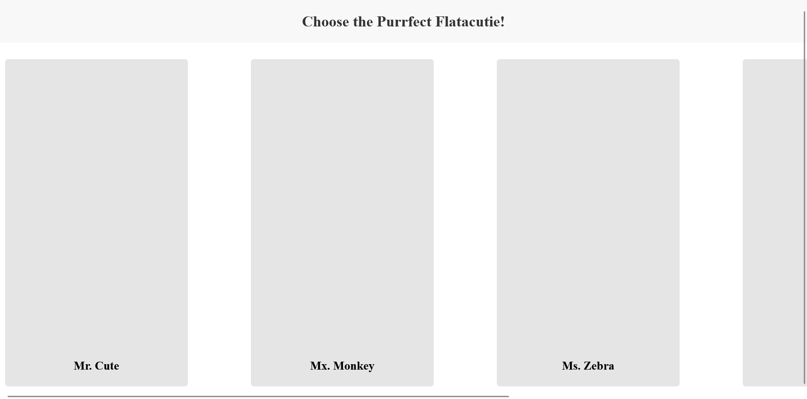

# Flatacuties

## Description
Week 2 Code Challenge at Moringa School. An app where you can vote for the cutest animal!.Click on an animal's name to view their image and a voting button. A vote button is also available for you to vote for your favourite animal.

## Project Setup & Pre-requisite Data
- In your project directory, create a db.json file and use this [data](https://docs.google.com/document/d/1EUcHU9gkydR3IfJDTebW5iNHP2BCMRcv508R7BAXSvo/edit?usp=sharing)
Links to an external site. for your server DB.
- Run this command to get the backend started: `json-server --watch db.json`
- Test your server by visiting this route in the browser: http://localhost:3000/characters

## Technologies Used
- HTML
- css
- JavaScript
  
## Site Screenshots
- Initial Page
  

- Display animals
  

- Display votes
  

## License
MIT License

Copyright (c) 2023 Moringa School

Permission is hereby granted, free of charge, to any person obtaining a copy
of this software and associated documentation files (the "Software"), to deal
in the Software without restriction, including without limitation the rights
to use, copy, modify, merge, publish, distribute, sublicense, and/or sell
copies of the Software, and to permit persons to whom the Software is
furnished to do so, subject to the following conditions:

The above copyright notice and this permission notice shall be included in all
copies or substantial portions of the Software.

THE SOFTWARE IS PROVIDED "AS IS", WITHOUT WARRANTY OF ANY KIND, EXPRESS OR
IMPLIED, INCLUDING BUT NOT LIMITED TO THE WARRANTIES OF MERCHANTABILITY,
FITNESS FOR A PARTICULAR PURPOSE AND NONINFRINGEMENT. IN NO EVENT SHALL THE
AUTHORS OR COPYRIGHT HOLDERS BE LIABLE FOR ANY CLAIM, DAMAGES OR OTHER
LIABILITY, WHETHER IN AN ACTION OF CONTRACT, TORT OR OTHERWISE, ARISING FROM,
OUT OF OR IN CONNECTION WITH THE SOFTWARE OR THE USE OR OTHER DEALINGS IN THE
SOFTWARE.
